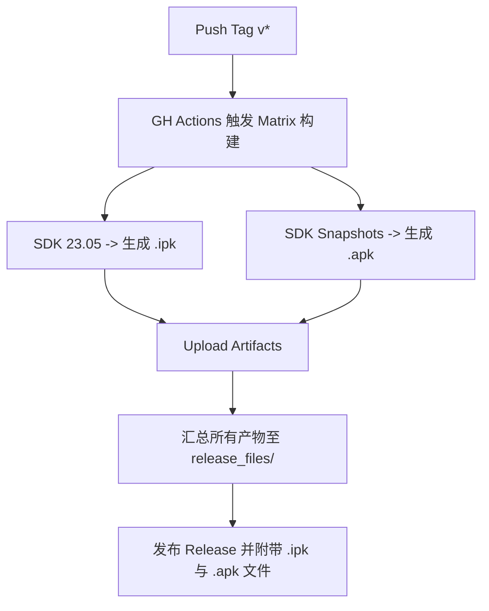

# GitHub Actions 进行 OpenWrt IPK 及 APK 双格式打包与 Release 发布指南

## 1. 模块职责与能力摘要
本工件用于记录 `luci-app-temp-status` 项目针对 OpenWrt 官方包管理器变革（<= 24.10 的 `opkg/.ipk` 与 >= 25.12/snapshots 的 `apk/.apk`）所实施的矩阵式 GitHub Actions 自动化构建与 Release 发布方案。

---

## 2. OpenWrt 版本差异根因分析

| OpenWrt 版本 | 默认包管理器 | 包文件格式 | 安装命令示例 |
| :--- | :--- | :--- | :--- |
| **<= 24.10** | `opkg` | `.ipk` (gzip+tar) | `opkg install xxx.ipk` |
| **>= 25.12** | `apk` (apk-tools) | `.apk` (Alpine格式) | `apk --allow-untrusted add xxx.apk` |

* **必要性**: `opkg` 与 `apk` 命令及格式不互相兼容，因此原 README 中区分两类版本的安装方式是**完全必要且符合 OpenWrt 官方规范**的。

---

## 3. GitHub Actions 矩阵构建方案 (Matrix Strategy)

在 `.github/workflows/build-ipk.yml` 中采用了 **Matrix** 矩阵构建：
* **`x86_64-23.05` SDK**: 生成供 OpenWrt <= 24.10 用的 `.ipk` 包；
* **`x86_64-snapshots` SDK**: 生成供 OpenWrt >= 25.12 用的 `.apk` 包。



---

## 4. 使用与发布流程

1. 打 Tag 并推送到仓库：
   ```bash
   git tag v0.8.1
   git push origin v0.8.1
   ```
2. 发布结果：
   Actions 将在同一个 Release 中同时提供 `.ipk` 和 `.apk` 文件，方便不同 OpenWrt 版本的用户下载使用。
